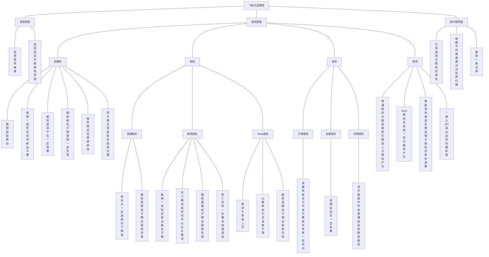

# AircraftWar
## Version 1.0.0

```mermaid
graph TD
    AircraftWar[飞机大战游戏]

    AircraftWar --- Menu[菜单界面]
    AircraftWar --- Game[游戏界面]
    AircraftWar --- Rank[排行榜界面]

    Menu --- chooseDifficulty[选<br>择<br>游<br>戏<br>难<br>度]
    Menu --- needMusic[选<br>择<br>是<br>否<br>开<br>启<br>游<br>戏<br>音<br>效]

    Game --- Hero[英雄机]
    Game --- Enemy[敌机]
    Game --- Prop[道具]
    Game --- Other[其他]

    Hero --- heroMove[跟<br>随<br>鼠<br>标<br>移<br>动]
    Hero --- heroShoot[每<br>隔<br>一<br>段<br>时<br>间<br>自<br>动<br>射<br>出<br>子<br>弹]
    Hero --- catchProp[碰<br>到<br>道<br>具<br>产<br>生<br>一<br>定<br>效<br>果]
    Hero --- HeroCrashBullet[碰<br>到<br>敌<br>机<br>子<br>弹<br>受<br>到<br>一<br>定<br>伤<br>害]
    Hero --- crashEnemy[碰<br>到<br>敌<br>机<br>后<br>直<br>接<br>损<br>毁]
    Hero --- getScore[用<br>子<br>弹<br>击<br>毁<br>敌<br>机<br>会<br>获<br>得<br>分<br>数]

    Enemy --- MobEnemy[普通敌机]
    Enemy --- EliteEnemy[精英敌机]
    Enemy --- Boss[Boss敌机]

    MobEnemy --- MobMove[自<br>动<br>以<br>一<br>定<br>速<br>度<br>向<br>下<br>移<br>动]
    MobEnemy --- MobCrashBullte[碰<br>到<br>英<br>雄<br>机<br>子<br>弹<br>会<br>受<br>到<br>伤<br>害]

    EliteEnemy --- EliteShoot[每<br>隔<br>一<br>段<br>时<br>间<br>自<br>动<br>射<br>出<br>子<br>弹]
    EliteEnemy --- EliteMove[向<br>下<br>移<br>动<br>的<br>同<br>时<br>可<br>以<br>左<br>右<br>移<br>动]
    EliteEnemy --- ElietCrashBullte[碰<br>到<br>英<br>雄<br>机<br>子<br>弹<br>会<br>受<br>到<br>伤<br>害]
    EliteEnemy --- EliteProp[死<br>亡<br>后<br>有<br>一<br>定<br>概<br>率<br>掉<br>落<br>道<br>具]

    Boss --- BossMove[悬<br>浮<br>于<br>界<br>面<br>上<br>方]
    Boss --- BossShoot[以<br>散<br>射<br>的<br>方<br>式<br>发<br>射<br>子<br>弹]
    Boss --- BossBullte[碰<br>到<br>英<br>雄<br>机<br>子<br>弹<br>会<br>受<br>到<br>伤<br>害]

    Prop --- BulletProp[子弹道具]
    Prop --- BloodProp[血量道具]
    Prop --- BombProp[炸弹道具]

    BulletProp --- BulletGet[英<br>雄<br>机<br>射<br>击<br>方<br>式<br>变<br>为<br>散<br>射<br>并<br>持<br>续<br>一<br>段<br>时<br>间]
    BloodProp --- BloodGet[英<br>雄<br>机<br>回<br>复<br>一<br>定<br>血<br>量]
    BombProp --- BombGet[消<br>灭<br>画<br>面<br>中<br>所<br>有<br>普<br>通<br>敌<br>机<br>和<br>精<br>英<br>敌<br>机]

    Other --- enemyAppear[普<br>通<br>敌<br>机<br>与<br>精<br>英<br>敌<br>机<br>在<br>画<br>面<br>上<br>方<br>随<br>机<br>产<br>生]
    Other --- bossAppear[boss<br>敌<br>机<br>在<br>达<br>到<br>一<br>定<br>分<br>数<br>时<br>产<br>生]
    Other --- difficulty[随<br>着<br>游<br>戏<br>难<br>度<br>的<br>增<br>加<br>相<br>关<br>属<br>性<br>会<br>有<br>所<br>调<br>整]
    Other --- bonusScene[*<br>输<br>入<br>HIT<br>或<br>hit<br>出<br>现<br>校<br>徽<br>彩<br>蛋]

    Rank --- addRecord[记<br>录<br>游<br>戏<br>分<br>数<br>和<br>玩<br>家<br>名]
    Rank --- showRank[根<br>据<br>不<br>同<br>难<br>度<br>展<br>示<br>对<br>应<br>排<br>行<br>榜]
    Rank --- removeRecord[删<br>除<br>一<br>条<br>记<br>录]
```

